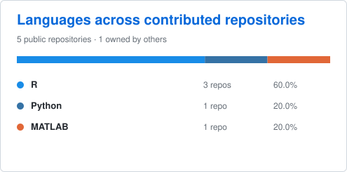
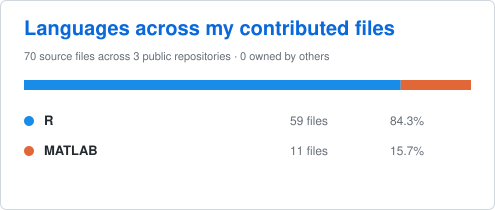

## Hi there 👋

I am Ayoushman Bhattacharya, a PhD Candidate at the [Department of Statistics and Data Science](https://sds.wustl.edu/), Washingtion University in St. Louis. 
Here is the link to my personal profile [https://sites.google.com/view/ayoushmanb](https://sites.google.com/view/ayoushmanb).

## GitHub Stats 📈

<!--

-->

  
  

## Repository Overview 🗂️

| Repository | Description | Language | Popularity |
| ---- | ----- | - | -- | 
|[hypergraph_subgraph](https://github.com/ayoushmanb/hypergraph_subgraph)| Inference on subraph frequency of a hypergraph| |   <!--  --> |
|[BrainNetworks_WSBM_SC_KM](https://github.com/ayoushmanb/BrainNetworks_WSBM_SC_KM)| Brain community detection | |   <!-- --> |
|[ggkodom](https://github.com/subroy13/ggkodom)| Visualizing individual-level longitudinal trajectories | |    <!--  --> |

